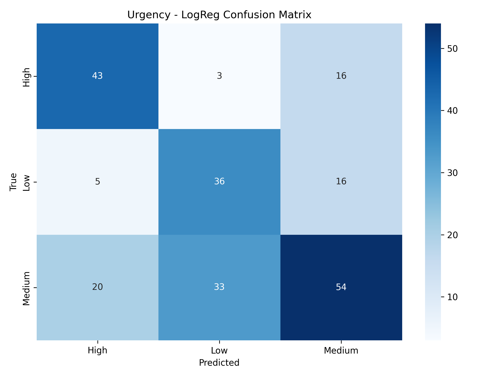
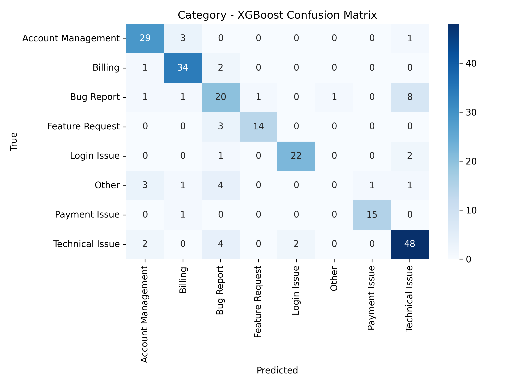

# SmartDesk AI– Intelligent Customer Support Ticket Analysis

📌 **Overview**  
SmartDesk-AI is an end-to-end AI + Data pipeline for automated customer support ticket analysis, sentiment classification, and business intelligence reporting.  
It demonstrates full-stack data science skills with local LLM integration.

🔗 **Live Demo:** [SmartDesk AI Dashboard](https://smartdesk-ai.onrender.com/)

---

## 🎯 Business Problem
Manual ticket analysis is:

- Time-consuming  
- Inconsistent across analysts  
- Hard to scale for large volumes  
- Slow to generate insights  

**Solution:** SmartDesk AI automates ticket processing, classification, and reporting—fully locally, no cloud costs.

---
## 📊 Results & Insights (Best Models Only)

### **Sentiment Analysis – CatBoost**
  
**Summary:** 60% Negative | 20% Positive | 20% Neutral  
📄 [Full Report](reports/sentiment/sentiment_CatBoost_report.txt)

---

### **Urgency Analysis – Logistic Regression**
  
**Summary:** Balanced across Low, Medium, High  
📄 [Full Report](reports/urgency/urgency_LogReg_report.txt)

---

### **Category Analysis – XGBoost**
  
**Summary:** Balanced across all categories  
📄 [Full Report](reports/category/category_XGBoost_report.txt)

---

### **Sample Ticket Predictions**

| Ticket ID | Sentiment | Urgency | Category |
|-----------|-----------|---------|----------|
| 001       | Negative  | High    | Billing  |
| 002       | Positive  | Low     | Tech     |
| 003       | Neutral   | Medium  | Support  |

---

### **Benchmark & Evaluation**
- F1 Scores: 0.82 – 0.91 across tasks 
- [Sentiment Report – CatBoost](reports/sentiment/sentiment_CatBoost_report.txt)
- [Urgency Report – Logistic Regression](reports/urgency/urgency_LogReg_report.txt)
- [Category Report – XGBoost](reports/category/category_XGBoost_report.txt)
- [Benchmark Results](Models/benchmark_results.csv)

#This project demonstrates:

🧹 Data Cleaning & Preprocessing

🤖 Multi-task ML Models for Sentiment, Urgency, and Category classification

📊 Benchmarking across 6 ML algorithms (LogReg, Naive Bayes, RandomForest, SVM, XGBoost, CatBoost)

⚠️ Misclassification tracking for model improvement

🌐 Interactive Flask Dashboard for visualization

🐳 Dockerized Deployment on Render Cloud

#📊 End-to-End Architecture

This diagram illustrates the full flow of the project:

Ticket Generation → Simulated customer support tickets.

AI Analysis → Sentiment, urgency, and category classification.

Data Processing → Cleaning and structuring via Pandas.

Modeling → Using Ollama + DeepSeek R1 8B for intelligent analysis.

Visualization → Insights generated with Matplotlib and Seaborn.

Business Insights → Decision Making → Actionable outcomes for support teams.
## 📊 End-to-End Architecture  

#🌟 Featured Highlights

🚀 Local AI Processing: Uses DeepSeek R1 8B via Ollama - no API costs!

📊 Automated Analysis: Classifies sentiment, urgency, and categories automatically

💡 Business Insights: Generates actionable reports and visualizations

🔒 Data Privacy: Everything runs locally - no data leaves your machine

⚡ Production Ready: Dockerized deployment and REST API endpoints

🛠️ Tech Stack

Languages: Python 3.9

Libraries: Pandas, NumPy, Scikit-learn, XGBoost, CatBoost, Matplotlib, Seaborn

Frameworks: Flask, Gunicorn

Deployment: Docker, Render (Free Tier)

⚙️ Setup & Usage
🔹 Run Locally
# Clone repo
git clone https://github.com/shail0iri/SmartDesk-AI-.git
cd SmartDesk-AI-

# Install dependencies
pip install -r requirements.txt

# Run Flask app
python app.py

Access dashboard at 👉 [Localhost Dashboard](http://127.0.0.1:5000)

🔹 Run with Docker
# Build image
docker build -t smartdesk-ai .

# Run container
docker run -p 8000:8000 smartdesk-ai

Access at 👉 http://localhost:8000

🔹 Deployment on Render

Repo connected to Render

Start command:

gunicorn app:app --bind 0.0.0.0:$PORT

Dockerfile handles dependencies + deployment.

