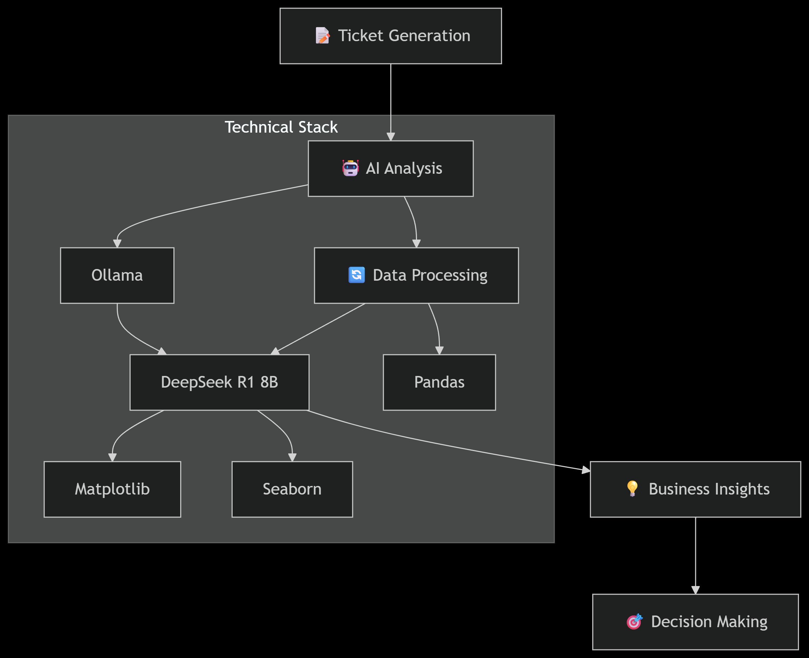
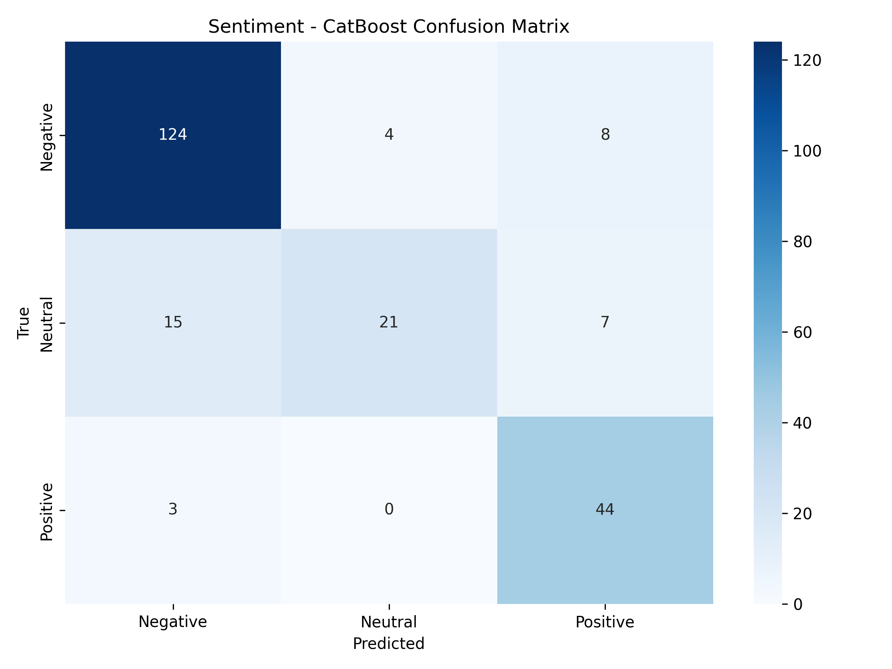

# SmartDesk AI– Intelligent Customer Support Ticket Analysis

📌 **Overview**  
SmartDesk-AI is an end-to-end AI + Data pipeline for automated customer support ticket analysis, sentiment classification, and business intelligence reporting.  
It demonstrates full-stack data science skills with local LLM integration.
Access the live dashboard [here](https://smartdesk-ai.onrender.com/).

---

## 🎯 Business Problem
Manual ticket analysis is time-consuming, inconsistent, and hard to scale.  
SmartDesk AI automates analysis for **sentiment**, **urgency**, and **category**, providing actionable insights locally.

---

## 🛠️ Technical Solution
- Generates synthetic tickets using local LLMs  
- Classifies tickets automatically (sentiment, urgency, category)  
- Generates visualizations and reports  
- Runs entirely locally  

---

This project demonstrates:

🧹 Data Cleaning & Preprocessing

🤖 Multi-task ML Models for Sentiment, Urgency, and Category classification

📊 Benchmarking across 6 ML algorithms (LogReg, Naive Bayes, RandomForest, SVM, XGBoost, CatBoost)

⚠️ Misclassification tracking for model improvement

🌐 Interactive Flask Dashboard for visualization

🐳 Dockerized Deployment on Render Cloud

📊 End-to-End Architecture

This diagram illustrates the full flow of the project:

Ticket Generation → Simulated customer support tickets.

AI Analysis → Sentiment, urgency, and category classification.

Data Processing → Cleaning and structuring via Pandas.

Modeling → Using Ollama + DeepSeek R1 8B for intelligent analysis.

Visualization → Insights generated with Matplotlib and Seaborn.

Business Insights → Decision Making → Actionable outcomes for support teams.
## 📊 End-to-End Architecture  

🌟 Featured Highlights

🚀 Local AI Processing: Uses DeepSeek R1 8B via Ollama - no API costs!

📊 Automated Analysis: Classifies sentiment, urgency, and categories automatically

💡 Business Insights: Generates actionable reports and visualizations

🔒 Data Privacy: Everything runs locally - no data leaves your machine

⚡ Production Ready: Dockerized deployment and REST API endpoints

🛠️ Tech Stack

Languages: Python 3.9

Libraries: Pandas, NumPy, Scikit-learn, XGBoost, CatBoost, Matplotlib, Seaborn

Frameworks: Flask, Gunicorn

Deployment: Docker, Render (Free Tier)

📂 Project Structure
SmartDesk-AI/
├── app.py                  # Flask web app (dashboard + API)
├── analyzed_tickets.csv    # Processed dataset
├── models/                 # Saved best ML models (joblib)
│   ├── sentiment_best.joblib
│   ├── urgency_best.joblib
│   └── category_best.joblib
├── figures/                # Benchmark visualizations + confusion matrices
│   ├── benchmark_f1_scores.png
│   ├── sentiment_LogReg_cm.png
│   └── ...
├── templates/
│   └── index.html          # Dashboard UI
├── requirements.txt        # Python dependencies
├── Dockerfile              # Container setup for deployment
├── evaluation_report.md    # Benchmarking report
├── benchmark_results.csv   # Tabular benchmark results
└── README.md               # Project documentation

⚙️ Setup & Usage
🔹 Run Locally
# Clone repo
git clone https://github.com/shail0iri/SmartDesk-AI-.git
cd SmartDesk-AI-

# Install dependencies
pip install -r requirements.txt

# Run Flask app
python app.py

Access dashboard at 👉 http://127.0.0.1:5000

🔹 Run with Docker
# Build image
docker build -t smartdesk-ai .

# Run container
docker run -p 8000:8000 smartdesk-ai

Access at 👉 http://localhost:8000

🔹 Deployment on Render

Repo connected to Render

Start command:

gunicorn app:app --bind 0.0.0.0:$PORT

Dockerfile handles dependencies + deployment.

📊 Results & Insights

Sentiment Distribution: 60% Negative, 20% Positive, 20% Neutral

Urgency Distribution: Balanced across Low, Medium, High

Best Models:

Sentiment → CatBoost

Urgency → Logistic Regression

Category → XGBoost

F1 Scores: 0.82 – 0.91 across tasks
## 📊 Reports & Insights

### Sentiment Analysis

Summary: 60% Negative, 20% Positive, 20% Neutral

### Urgency Analysis

Balanced across Low, Medium, High

### Category Analysis

### Sample Ticket Predictions
| Ticket ID | Sentiment | Urgency | Category |
|-----------|-----------|---------|----------|
| 001       | Negative  | High    | Billing  |
| 002       | Positive  | Low     | Tech     |
| 003       | Neutral   | Medium  | Support  |

### Full Reports
- [Sentiment Report](reports/sentiment)  
- [Urgency Report](reports/urgency)  
- [Category Report](reports/category)  
- [Benchmark Results](Models/benchmark_results.csv)

